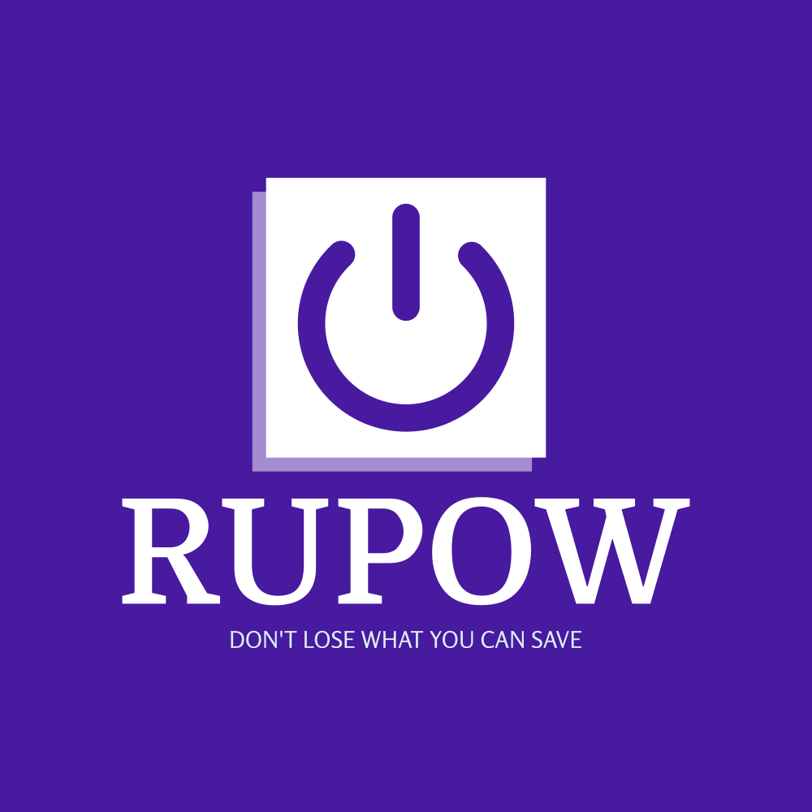
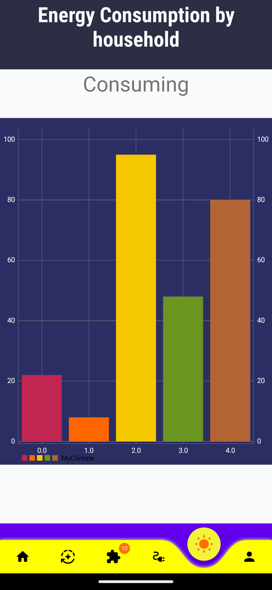
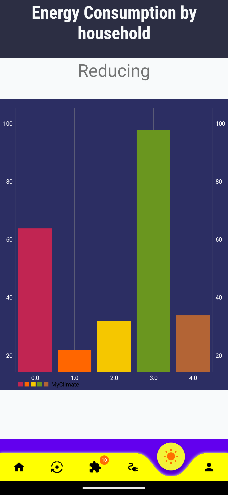
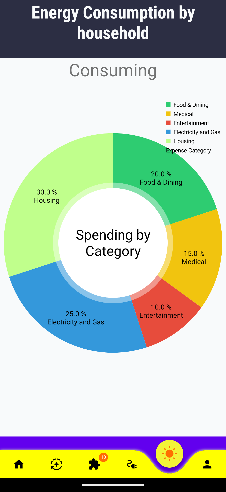
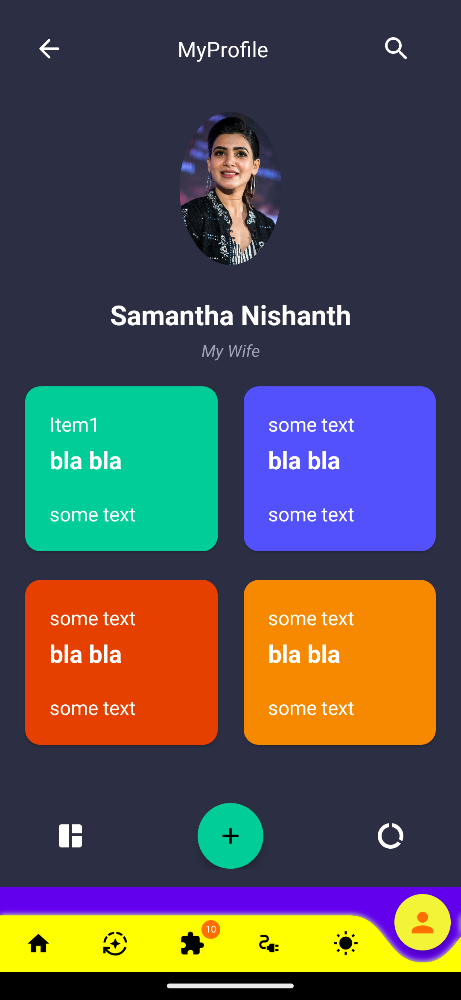

# Rupow - Android App 

Rupow is a self-hosted read-it-later app.  
It is made as team project for Software-engineering course.Rupow is free and open source. You need a google account first, which you are going to use in this app.

Rupow is available on the github release.

<a href="https://hub.video/">
    

    
        
          GET IT ON
          Github Release
        
    

</a>  

## About

Rupow has been made for you to know about the power consumption in your household and to help you to participate in global fight against climatic actions by fulfilling one or more of sustainable goals.
You can download Rupow from github page.
This application was created by B-Tech CS Students for SE-Course and released under (Not yet created).

## Features

The android app lets you:
- Add Something

## Screenshots

## Permissions

On Android versions prior to Android 6.0, Rupow requires the following permissions:
- Full Network Access.
- View Network Connections.
- Run at startup.
- Read and write access to external storage.

The "Run at startup" permission is only used if Auto-Sync feature is enabled and is not utilised otherwise. The network access permissions are made use of for downloading content. The external storage permission is used to cache article images for viewing offline.

## Contributing

Rupow app is a free and open source project developed by volunteers. Any contributions are welcome. Here are a few ways you can help:
 * [Report bugs and make suggestions.](https://github.com/wallabag/android-app/issues)
 * [Translate the app](https://hosted.weblate.org/projects/wallabag/android-app/) (you don't have to create an account).
 * Write some code. Please follow the code style used in the project to make a review process faster.

## License

This application is released under GNU GPLv3 (see [LICENSE](LICENSE)).
Some of the used libraries are released under different licenses.
